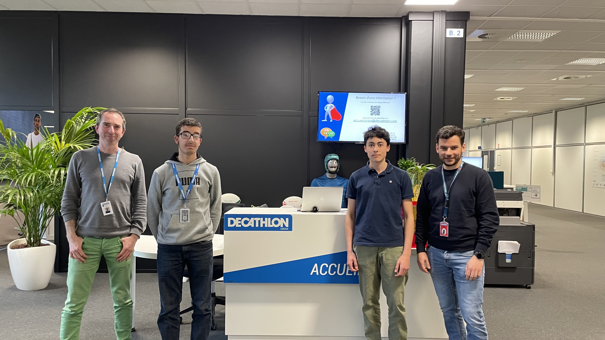

Bonjour à tous , 
Je vais vous présenter dans ce blog mon stage effectué dans l'entreprise Decathlon, au coeur du systeme informatique. 
Je vais vous présenter ce rapport de stage en 4 parties:

## L'équipe intégrée et les activités faites pendant ce stage

## Les métiers découverts

[Le Product owner / Project manager](../2023-03-22-l%C3%A9a-product-owner.md)  
[Le Tech lead](../2023-03-22-jeremy-tech-lead)  
[L'Intégrateur email](../2023-03-22-alexandre-integrateur-e-mail.md)  
[L'Intégrateur Salesforce Marketing Cloud](../2023-03-22-julien-integrateur-salesforce.md)  
[Le Développeur frontend](../2023-03-22-antoine-developpeur-frontend.md)  
[Le Développeur backend](../2023-03-22-fabien-developpeur-back-end.md)  
[Le Quality Engineer](../2023-03-22-jean-marc-quality-engineer.md)  

## Mes impressions sur le stage

## Ce que j'ai appris

Bonne lecture !
